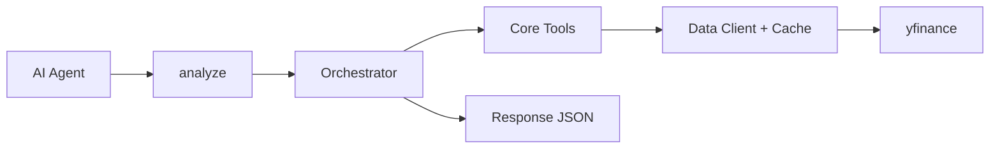
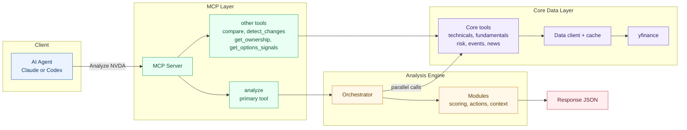
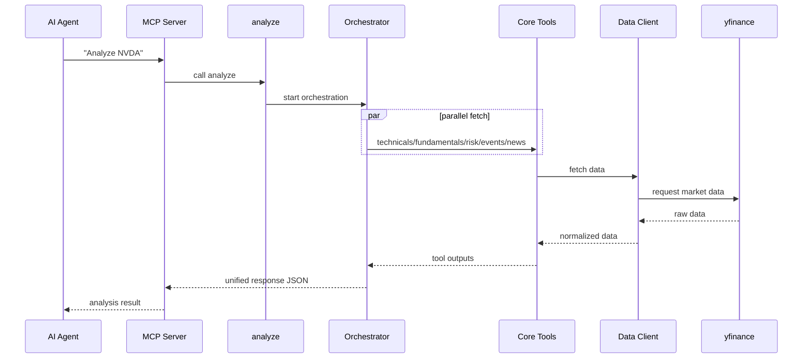

# Stock Analysis MCP

[](tests/)
[](https://www.python.org/)
[](https://modelcontextprotocol.io)
[](https://github.com/ranaroussi/yfinance)
[](LICENSE)

AI-assisted single-stock analysis for individual investors using Claude Code,
Codex, or any MCP client.

Ask for a stock and get a disciplined buy / wait / avoid read, risk summary,
position-sizing context, catalyst notes, and a five-question dislocation check.

Informational only — not financial advice.

## Example Output

Shortened example from a live `HOOD` analysis on 2026-05-13. Market data changes over time.

```text
HOOD — Robinhood Markets @ $76.67

Decision: WAIT
Reason: falling-knife gate — severe decline with broken trends
Verdict: neutral, score -0.10 (scale -1 to +1), low confidence
Risk: EXTREME

Dislocation Check

Question                              Answer    Read
Is it down enough?                    Yes       -50.2% from 52W high.
Is the business still good?           Yes       Net margin 41.1%, FCF +$3.0B, revenue +15.1% YoY.
Is the balance sheet safe?            Yes       Net cash positive balance sheet.
Is the long-term thesis intact?       Watch     Good business, but high volatility and rich valuation need monitoring.
Has price broken more than business?  Unclear   Business is intact, but valuation is still rich and technicals are broken.

Bottom line: HOOD looks like a strong business in a broken chart, not a clear buy.
Wait for stabilization and a volatility drop before adding.
```

## Quick Start

### Claude Code

```bash
claude mcp add -s user stock-analysis -- uvx --from git+https://github.com/nickzren/stock-analysis-mcp stock-analysis
```

### Codex

```bash
codex mcp add stock-analysis -- uvx --from git+https://github.com/nickzren/stock-analysis-mcp stock-analysis
```

## How To Use

Ask your agent:

```text
Analyze HOOD
```

With account sizing:

```text
Analyze HOOD with account size $3000
```

Swing-trade check:

```text
Any swing setup on HOOD? Account size $3000.
```

`analyze_trade_setup` returns an action (`trade_now`, `enter_on_trigger`, `watch`,
`no_setup`, `avoid`, `wait_for_data`) plus an executable plan when actionable.
`trade_now` is only possible during regular market hours with fresh data; stale,
delayed, or unverifiable data downgrades the action and explains why in `blockers`.

The default report is compact and decision-focused. It still computes the full
underlying analysis before returning the shorter investor view.

## What It Checks

- **Action now:** buy, starter, hold, wait, avoid, or wait for data
- **Hard gates:** falling knife, weak liquidity, poor data quality, missing runway
- **Business quality:** growth, margins, free cash flow, profitability
- **Balance-sheet safety:** debt, cash runway, dilution risk
- **Technicals:** trend, momentum, moving averages, RSI, MACD, ATR
- **Risk:** volatility, beta, drawdown, stop levels, position sizing
- **Catalysts:** earnings, analyst targets, news, short interest, ownership
- **Dislocation check:** whether price is broken more than the business

## Advanced Usage

By default, `analyze` returns the `standard` detail level: a compact investor report covering:
- **Decision card** — what to do now, sizing, entry/stop, conditions, and next review
- **Hard gates** — pre-buy checks such as falling knife, weak liquidity, missing runway, and poor data quality
- **Executive summary** — materiality-first narrative (leads with what matters most)
- **Section summaries** — 1–2 sentence takeaways per major section
- **Verdict** — score, tilt, confidence, components, pros, and cons
- **Dislocation check** — five-question broken-price vs. broken-business read
- **Action zones** — compact ATR/valuation-based levels and sizing context
- **Catalyst intelligence** — structured bullish/bearish news catalyst tags
- **Analyst coverage** — consensus rating + targets
- **Ownership, short interest, sector comparison, and relative performance**
- Compact fundamentals, risk, events, and news summaries

The output follows a consistent schema, making it easy to compare multiple stocks or track changes over time.
For invalid/delisted symbols, `analyze` returns a top-level error (`error=true`) with diagnostics in `data_quality.tool_failures`.
For detailed rendering guidance, read the MCP resource `stock-analysis://guides/analyze-rendering`.

### Optional Inputs

`analyze` works without any extra parameters. Optional inputs refine sizing and response size:

- `account_size`: portfolio/account size used for dollar sizing output
- `risk_per_trade_pct`: percent of account you are willing to lose if a stop is hit
- `max_position_pct`: hard cap for a single position
- `detail`: `standard` (default), `decision` for the smallest action surface, or `full` for the previous complete audit/debug payload

If `account_size` is omitted, sizing remains percent-based. If a caller depends on fields omitted from `standard` (for example `decision_context`, `dip_assessment`, `decision_modes`, or full `company_profile`), call `analyze(..., detail="full")`.

## Available Tools

### Primary

| Tool | Description |
|------|-------------|
| `analyze` | Single-stock analysis with token-efficient `standard` output by default, optional `decision`/`full` detail levels, dollar sizing, and company-name resolution |
| `analyze_trade_setup` | Swing-trade setup card (long-only, days-to-weeks): setup type, entry trigger, stop, targets, R-based sizing, time stop, and freshness-gated action |

### Comparative Analysis

| Tool | Description |
|------|-------------|
| `compare` | Side-by-side comparison for 2-5 symbols with rankings |
| `detect_changes` | Diff current analysis vs prior snapshot (material changes) |

### Market Data & Signals

| Tool | Description |
|------|-------------|
| `search_symbol` | Search for stock symbols by company name or ticker |
| `get_stock_summary` | Basic stock info (name, sector, price, market cap) |
| `get_price_history` | Historical price data with summary and resource URI |
| `get_technicals` | Technical indicators (SMA, EMA, RSI, MACD, ATR, Bollinger, Fibonacci, OBV) plus a `short_term` block (levels, gap, RVOL, compression); `timeframe="swing"` adds intraday VWAP, time-adjusted RVOL, hourly trend, and alignment with freshness disclosure |
| `get_fundamentals` | Financial metrics, valuation history, analyst estimates, dividends |
| `get_events` | Earnings dates, dividends, splits |
| `get_news` | Recent news headlines, earnings surprise data, and structured catalyst tags |
| `get_ownership` | Insider transactions and institutional ownership trends |
| `get_options_signals` | Options-derived signals (IV, put/call, unusual activity) |

`get_price_history` returns a `price://...` resource URI backed by an in-memory, process-local cache. Read that resource during the same server session; it does not survive restarts. Some MCP clients (observed: Claude Desktop) serve resource reads from a separate server process where that cache is empty — if resource reads return "not cached", fall back to `include_preview=true` for inline bars.

### Watchlist

| Tool | Description |
|------|-------------|
| `manage_watchlist` | Add, remove, or list symbols (max 25); normalized and deduplicated |
| `scan_watchlist` | Two-phase screen for swing setups: cheap daily screen for all symbols, full card (`analyze_trade_setup`) only for candidates and previously-actionable ones; `changes` lists transitions since the last scan, `rows` is the full current state. Near earnings (≤21 days) the card fills `event_risk.expected_move_pct` from the ATM straddle and warns when the stop sits inside the implied move |

**Storage:** Watchlist and scan state persist under `$STOCK_ANALYSIS_DATA_DIR` (if set), else `$XDG_DATA_HOME/stock-analysis`, else `~/.local/share/stock-analysis`. The same directory stores `watchlist.json` and `scan_state.json`; corrupt files degrade to empty state with a warning instead of failing. Run `manage_watchlist action=list` to inspect the current watchlist and storage state.

**Scheduled Brief Example:** Run `scan_watchlist` from a scheduled task before market open (e.g., via cron or `at` command) with optional `account_size`, `risk_per_trade_pct`, and `max_position_pct` parameters to match your account. Lead the report with the `changes` key to focus on symbol transitions; `rows` provides full current state for trend analysis. First scan returns an empty `changes` list with a `first_scan` warning; transitions appear starting from the second scan.

### Portfolio & Utilities

| Tool | Description |
|------|-------------|
| `analyze_my_position` | Hold/sell analysis for existing positions |
| `analyze_portfolio` | Concentration, sector exposure, correlation |
| `check_data_quality` | Verify data availability for symbols |

## Technical Details

**Session Classification and Holidays**

Session classification is holiday-aware via a vendored NYSE calendar
(2025–2030, full holidays and 13:00 early closes); outside that range it
falls back to clock-only weekday logic, reported as
`method="clock_only_no_holidays_fallback"` in `get_market_state` provenance.

<details>
<summary>Architecture</summary>

Read left to right: request -> orchestration -> parallel data fetch -> synthesized response.

### Quick Flow



### Detailed Flow



Color legend: `blue=client`, `green=entry`, `orange=engine`, `purple=data`, `red=output`.

Node map: `S=src/stock_analysis/server.py`, `O=src/stock_analysis/tools/analyze/orchestrator.py`, `D=src/stock_analysis/data/`.

### Request Lifecycle



</details>

## Development

```bash
# Install dev dependencies
uv pip install -e ".[dev]"

# Run tests
uv run pytest

# Linting
uv run ruff check src tests
```

## Disclaimer

This tool is for **informational purposes only**. It is not financial advice. Always do your own research and consult a qualified financial advisor before making investment decisions. The authors are not responsible for any financial losses incurred from using this tool.
