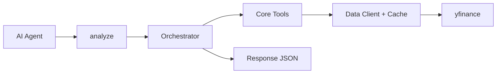
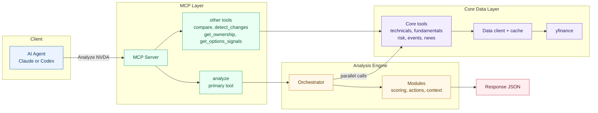
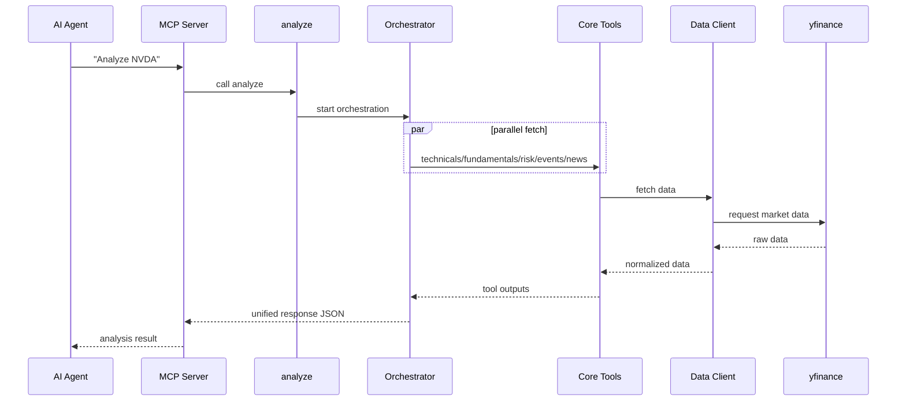

# Stock Analysis MCP Server

[](tests/)
[](https://www.python.org/)
[](https://modelcontextprotocol.io)
[](https://github.com/ranaroussi/yfinance)
[](LICENSE)

An MCP server that gives AI agents (Claude Code, Codex, etc.) single-stock analysis capabilities.
Informational only — not financial advice.

## Philosophy

**One command, complete picture.** Just say "Analyze AAPL" and get a comprehensive,
human-readable report with a consistent JSON schema, plus default `core`,
`balanced`, and `speculative` decision modes so non-technical users can act
based on style without changing any code.

## Architecture

Read left to right: request -> orchestration -> parallel data fetch -> synthesized response.

### Quick Flow



### Detailed Flow



Color legend: `blue=client`, `green=entry`, `orange=engine`, `purple=data`, `red=output`.

Node map: `S=src/stock_analysis/server.py`, `O=src/stock_analysis/tools/analyze/orchestrator.py`, `D=src/stock_analysis/data/`.

Output shape details are documented in `Usage -> Full Analysis (Recommended)`.

### Request Lifecycle



## Quick Start

### Claude Code

```bash
claude mcp add stock-analysis -- uvx --from git+https://github.com/nickzren/stock-analysis-mcp stock-analysis
```

### Codex

```bash
codex mcp add stock-analysis -- uvx --from git+https://github.com/nickzren/stock-analysis-mcp stock-analysis
```

## Usage

### Full Analysis (Recommended)

The primary way to use this server—just say:

```
"Analyze NVDA"
```

If you want dollar sizing, you can still pass account context:

```
analyze("ASTS", account_size=3000)
```

This returns a comprehensive JSON report covering:
- **Executive summary** — materiality-first narrative (leads with what matters most)
- **Dislocation framework** — plain-English “broken price vs broken business” view: drawdown setup, business integrity, balance-sheet safety, thesis integrity, mismatch verdict, and what to do now
- **Section summaries** — 1–2 sentence takeaways per major section
- **Verdict** — score, tilt (bullish/neutral/bearish), confidence, horizon fit
- **Policy action** — mid/long-term decision framing with position sizing ranges (informational)
- **Decision modes** — separate `core`, `balanced`, and `speculative` decision blocks from the same underlying analysis
- **Action zones** — ATR-based price levels (accumulate/reduce/stop)
- **Dip assessment** — oversold metrics, support levels, bounce potential, entry timing
- **Decision context** — what would change the verdict (bullish_if/bearish_if)
- **Catalyst intelligence** — structured bullish/bearish news catalysts (guidance, dilution, approvals, contracts, etc.)
- **Analyst coverage** — consensus rating + targets
- **Ownership & short interest** — insiders/institutions/float, days-to-cover
- **Governance** — audit/board/comp/rights risk scores
- **Company profile** — description, industry, employees, website
- Technical signals, fundamental metrics, risk regime, news sentiment, events

The output follows a consistent schema, making it easy to compare multiple stocks or track changes over time.
For invalid/delisted symbols, `analyze` returns a top-level error (`error=true`) with diagnostics in `data_quality.tool_failures`.

### Optional Inputs

`analyze` works without any extra parameters. Optional inputs only refine sizing:

- `account_size`: portfolio/account size used for dollar sizing output
- `risk_per_trade_pct`: percent of account you are willing to lose if a stop is hit
- `max_position_pct`: hard cap for a single position

If `account_size` is omitted, the analysis still returns the default `core` / `balanced` / `speculative` modes, but keeps sizing percent-based.

## Available Tools

### Primary

| Tool | Description |
|------|-------------|
| `analyze` | Comprehensive single-stock analysis with default Core/Balanced/Speculative modes, optional dollar sizing, human-readable summaries, and company-name resolution for common inputs |

### Comparative Analysis

| Tool | Description |
|------|-------------|
| `compare` | Side-by-side comparison for 2-5 symbols with rankings |
| `detect_changes` | Diff current analysis vs prior snapshot (material changes) |

### Market Data & Signals

| Tool | Description |
|------|-------------|
| `search_symbol` | Search for stock symbols by company name or ticker |
| `get_stock_summary` | Basic stock info (name, sector, price, market cap) |
| `get_price_history` | Historical price data with summary and resource URI |
| `get_technicals` | Technical indicators (SMA, EMA, RSI, MACD, Bollinger, Fibonacci, OBV) |
| `get_fundamentals` | Financial metrics, valuation history, analyst estimates, dividends |
| `get_events` | Earnings dates, dividends, splits |
| `get_news` | Recent news headlines, earnings surprise data, and structured catalyst tags |
| `get_ownership` | Insider transactions and institutional ownership trends |
| `get_options_signals` | Options-derived signals (IV, put/call, unusual activity) |

### Portfolio & Utilities

| Tool | Description |
|------|-------------|
| `analyze_my_position` | Hold/sell analysis for existing positions |
| `analyze_portfolio` | Concentration, sector exposure, correlation |
| `check_data_quality` | Verify data availability for symbols |

## Development

```bash
# Install dev dependencies
uv pip install -e ".[dev]"

# Run tests
uv run python -m pytest tests/ -v

# Linting
ruff check src/ tests/
```

## Disclaimer

This tool is for **informational purposes only**. It is not financial advice. Always do your own research and consult a qualified financial advisor before making investment decisions. The authors are not responsible for any financial losses incurred from using this tool.
